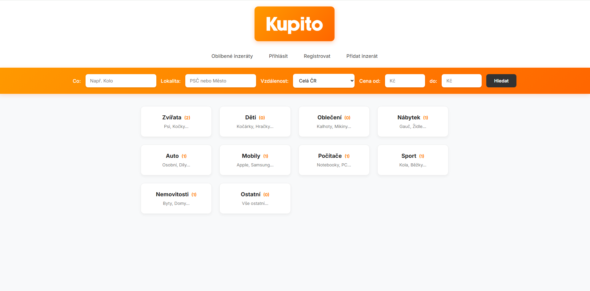
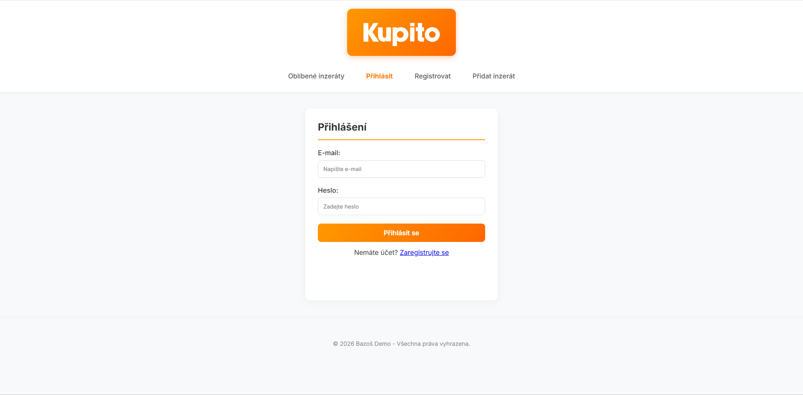
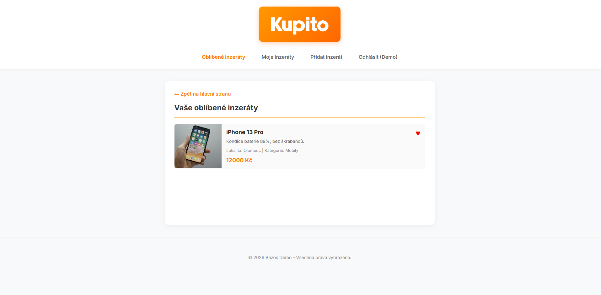
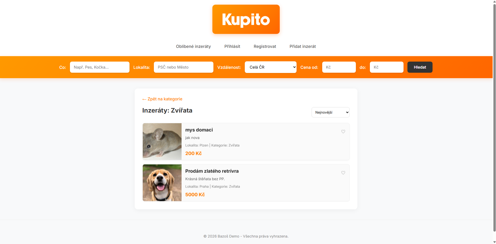
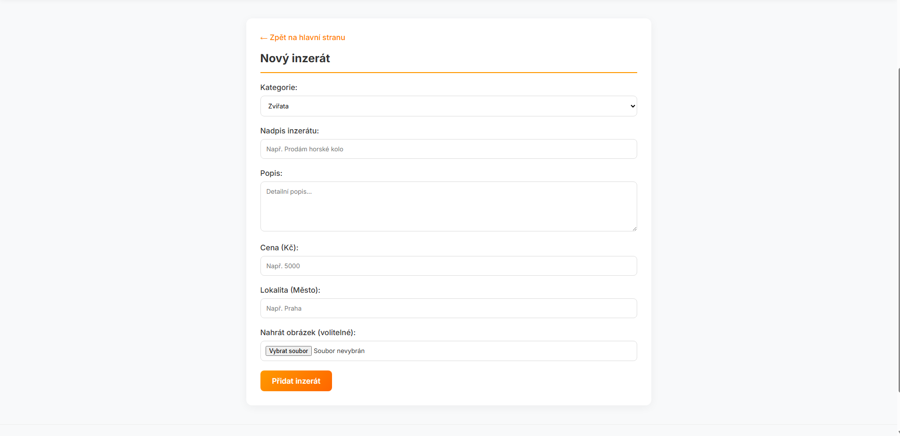
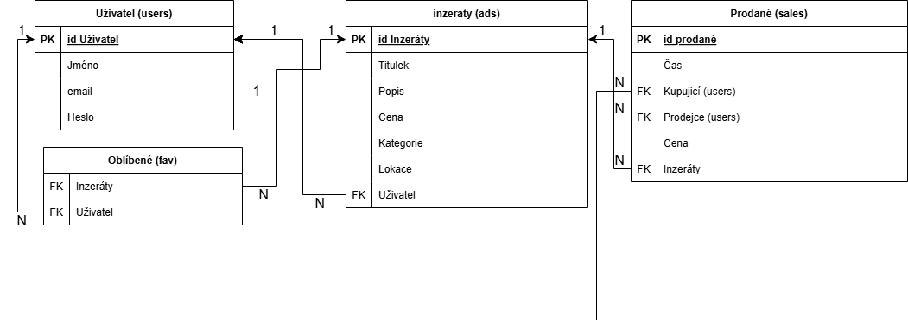

<p align="center">
    
</p>

# Bazoš (Kupito)

*Webová aplikace pro inzerci, prodej a správu bazarových produktů.*

Bazoš je školní projekt vytvořený pro předmět **Programování II** (PRG2). Cílem projektu bylo vytvořit plnohodnotnou webovou aplikaci propojenou s databází, která uživatelům umožňuje procházet, vyhledávat, přidávat, kupovat a ukládat inzeráty do oblíbených.

## Zadání

1. **Téma:** Inzertní portál / Online bazar (Kupito).
2. **Typ projektu:** Webová aplikace napojená na databázi MySQL (správa uživatelů, kategorií a inzerátů).
3. **Specifikace:** Registrace a autentizace uživatelů, vystavování nových inzerátů, nákup položek a správa oblíbených produktů.

## Hlavní funkce

### Uživatelské funkce

* **Autentizace uživatelů:** Kompletní registrační a přihlašovací systém (`login.html`, `register.html`).
* **Prohlížení a filtrace:** Načítání inzerátů podle zvolených kategorií z databáze a filtrování podle vyhledávaného textu.
* **Správa vlastních inzerátů:** Možnost vystavit nový inzerát s popisem, cenou a kategorií a zobrazení přehledu vlastních nabídek (`moje-inzeraty.html`).
* **Systém oblíbených:** Uživatelé si mohou ukládat inzeráty do svého seznamu oblíbených položek (`oblibene.html`).
* **Nákup produktů:** Možnost zakoupit vystavené zboží, čímž se změní stav inzerátu.

### Ukládání dat
* **MySQL Databáze:** Úložiště pro data uživatelů (id, jméno, email, heslo), kategorie, inzeráty a tabulku oblíbených položek.
* **Zabezpečení:** Uživatelská hesla jsou bezpečně **hashována** před uložením do databáze pomocí vestavěné PHP funkce `password_hash()`.

## Použité technologie

- **PHP**: Použito pro tvorbu backendového a komunikujícího s databází.
- **JavaScript**: Obstarává filtrování produktů.
- **SQL**: Zajišťuje databázi.
- **HTML & CSS**: Struktura a vizuální design uživatelského rozhraní aplikace.

## Struktura projektu

```bash
ProjPRG2/
└─ Bazos/
   ├─ api/                          # Backend (PHP)
   │  ├─ ads.php                    # Načítání, vytváření a mazání inzerátů
   │  ├─ auth.php                   # Registrace, přihlašování a odhlašování uživatelů (Session)
   │  ├─ buy.php                    # Logika pro nákup inzerovaných položek
   │  ├─ categories.php             # Načítání dostupných kategorií z DB
   │  ├─ db.php                     # připojení k MySQL
   │  └─ favorites.php              # Přidávání a odebírání inzerátů z oblíbených
   ├─ img/
   │  └─ kupitologo_300x125.png     # Logo aplikace (Kupito)
   ├─ databaze.sql                  # Export struktury a testovacích dat databáze
   ├─ detail.html                   # Detailní zobrazení konkrétního inzerátu
   ├─ index.html                    # Úvodní stránka s přehledem kategorií
   ├─ inzeraty.html                 # Seznam a filtrace všech dostupných inzerátů
   ├─ login.html                    # Přihlašovací formulář
   ├─ moje-inzeraty.html            # Přehled inzerátů vytvořených přihlášeným uživatelem
   ├─ oblibene.html                 # Přehled inzerátů, které si uživatel uložil
   ├─ pridat-inzerat.html           # Formulář pro vložení nového zboží do bazaru
   ├─ register.html                 # Registrační formulář pro nové uživatele
   ├─ script.js                     # Filtrování produktů.
   ├─ style.css                     # Globální stylování aplikace
   └─ README.md                     # Tento soubor
```
## Závěr
Díky tomuto projektu jsem si mohl vyzkoušet vývoj webové aplikace. Pro férovost chci zmínit, že jsem při vývoji občas využil AI. Určitě za mě ale nenapsala celý projekt používal jsem ji spíš jako pomocníka na ty nejsložitější věci, na kterých jsem se zasekl (například při tvorbě filtrace inzerátů v JavaScriptu nebo u složitějších SQL dotazů).

Veškerý návrh, frontend (HTML/CSS) i celou základní logiku jsem si odpracoval sám. Díky tomu jsem se toho spoustu naučil, ušetřil si nervy při zbytečných zásecích a projekt tak splnil to, co měl.

## Obrazovky - ukázka

### Uvodní obrazovka


### Přihlášení


### Oblíbené


### Inzeráty


### Vytvoření inzerátu


### Diagram

